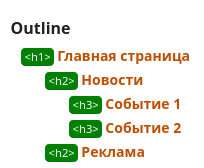

Последовательное изложение, заголовки как в книге

до 2014 года свой алгортм аутлайн html 4

Проблема понять что тут к чему относится. Алгоритм запустался

````html
<div>
<h1>Заголовок 1</h1>
Контент 1
    <h2>Заголовок 2</h2>
    Контент 2
        <h3>Заголовок 3</h3>
        Контент 3
</div>

<div>контакты</div>
````

Стандарт html 5

Секции
body - один корневой
article - много

Можем ли мы на одной странице говорить про несколько сущностей, или только про одну.

Заголовков больше нет, содержит только один заголовок `h`, тогда придумали секционные теги с заголовком

````html
<article>
  <h></h>
  <article>
    <h></h>
  </article>
</article>
<section>
  <h></h>
</section>
````

Чем больше вложенность секционного тега, тем меньше значимость тега который его описывает.
Не разрешалось больше одного заголовка в рамках одного секционного тега


Но этого было мало, нужна обратная совместимость с html 4, сохранили уровни заголовков

````html
<article>
  <h1></h1>
  <article>
    <h2></h2>
  </article>
</article>
````

Но алгоритм расчета был очень сложным, стали думать над алгоритмом формирования неявных секций

до 2017 года семантика была не нужна
https://html.spec.whatwg.org/multipage/sections.html#outline

с 22 года изменился алгоритм ouline
Каждая секция должна содержать только один заголовок. Чем глубже вложенность нужно увеличивать номер тега h

````html
<!doctype html>
<html lang="en">
<head>
<meta charset="UTF-8">
             <meta name="viewport" content="width=device-width, user-scalable=no, initial-scale=1.0, maximum-scale=1.0, minimum-scale=1.0">
                         <meta http-equiv="X-UA-Compatible" content="ie=edge">
             <title>Document</title>
</head>
<body>
<h1>Главная страница</h1>
<section>
  <h2>Новости</h2>
  <article>
    <h3>Событие 1</h3>
    <article>
      <h4>Событие 1.1</h4>
    </article>
  </article>
  <article>
    <h3>Событие 2</h3>
  </article>
</section>
<aside>
  <h2>Реклама</h2>
</aside>
</body>
</html>

````


Валидатор https://validator.w3.org/

https://doka.guide/html/header/
https://adrianroselli.com/2016/08/there-is-no-document-outline-algorithm.html

Стили не имеют никакой разницы, нужно забить на отображение, так лучше верстать
А только потом накладывать стили flexbox grid

1. Сначала сформировать семантику
2. Потом стили, которые будут приводить к тому виду который нужен

Алгоритм outline в HTML5 позволяет создавать семантически правильную структуру документа, основанную на секционных элементах и заголовках. Это улучшает доступность (screen readers) и SEO. Главное правило: каждая секция должна иметь заголовок, а вложенность определяет иерархию разделов.

В 22 году весь алгоритм был выкинут. Коллизии больше одного заголовка


article - можно вырвать из контекста и понять смысл
section - секция чего-то
nav - описывает особенности навигации по текущей странице, хленбные крошки, особенности навигации
aside - это выделение контента внутри другого контента, который не имеет отношение к текущему контенту, реклама например
main - 
b - не обязательно связано с текущей страницей, но выделенный фрагмент важен для всего проекта в **целом**
strong - выделяет фразу который важен для **текущего фразовой части страницы**


````html
<h1></h1>
<article>
  <h2></h2>
  <section>
    <h3></h3>
  </section>
</article>
<article>
    <h2></h2>
    <section>
        <h3></h3>
    </section>
</article>
````
Заголовки нужны для разметки последовательных названий разделов в тексте.

Ранее в разметке не было способа выразить логическую структуру древовидных разделов
https://css-live.ru/html5/problema-vybora-struktury-dokumenta.html#bigger-dilemma

https://css-live.ru/html5/nuzhen-li-nam-novyj-zagolovochnyj-element.html
